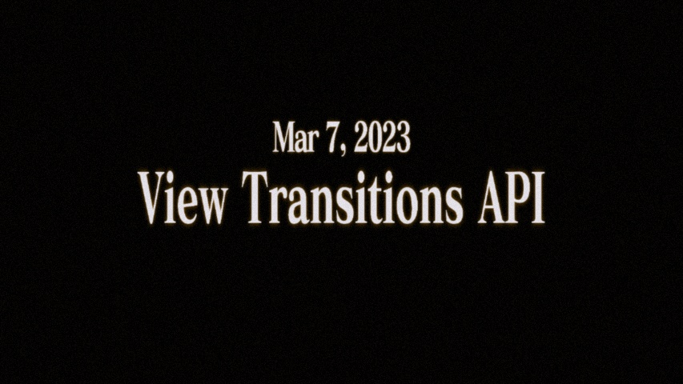
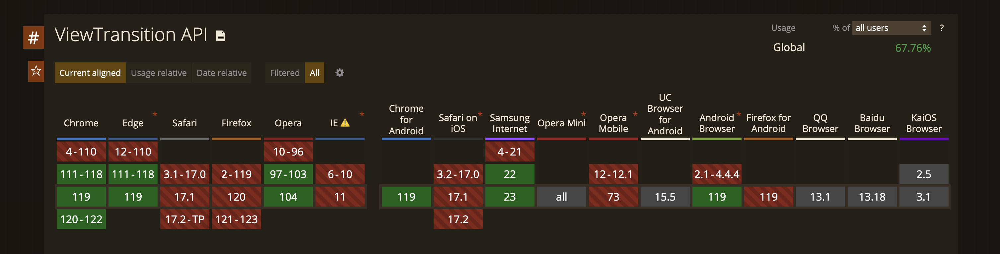

# View Transitions API

心得與分享

<div class="absolute bottom-10">
  <span class="font-700">
    Jeff&nbsp;&nbsp;&nbsp;2023/12
  </span>
</div>

---
layout: default
---

# 從一個範例開始說起?

<iframe class="w-1600px h-800px mt-16 scale-40 transform-origin-tl" title="page transitions" src="https://pagetransitions.netlify.app/" frameborder="no" loading="lazy" allowtransparency="true" allowfullscreen="true">
</iframe>

---
layout: two-cols
---

# 至此之前的努力和方向
## FLIP


<div class="mt-10"><mingcute-award-fill /> FLIP動畫概念</div>
<div class="text-24px mt-2"><span class="text-red">F</span>irst, <span class="text-red">L</span>ast, <span class="text-red">I</span>nvert, <span class="text-red">P</span>lay</div>
<div class="text-14px mt-4 pr-10">JavaScript 和 CSS 的結合。使用 JavaScript 進行計算，但讓 CSS 為您處理動畫。</div>

<div class="relative w-40 h-40 mt-4">
  
</div>

::right::

<div class="mt-24"></div>

```js  {1-2|3-5|6-8|9-11|12-20|all}
// Get the first position.
const first = el.getBoundingClientRect();

// Move it to the end.
el.classList.add('--at-the-end');

// Get the last position.
const last = el.getBoundingClientRect();

// Invert.
const invert = first.top - last.top;

// Go from the inverted position to last.
const player = el.animate([
  { transform: `translateY(${invert}px)` },
  { transform: 'translateY(0)' }
], {
  duration: 300,
  easing: 'cubic-bezier(0,0,0.32,1)',
});
```

---
layout: two-cols
---

# 至此之前的努力和方向
## GSAP Flip


<div class="mt-10"><mingcute-award-fill /> GSAP Flip plugin</div>

```js
const state = Flip.getState(".targets");

//...

Flip.from(state, {
  duration: 1,
  ease: "power1.inOut",
  absolute: true,
  onComplete: myFunc,
});
```
::right::

<iframe class="w-400px h-300px mt-24" scrolling="no" title="Flip Plugin swap elements" src="https://codepen.io/GreenSock/embed/OJNYjmz?default-tab=" frameborder="no" loading="lazy" allowtransparency="true" allowfullscreen="true">
</iframe>

---
layout: two-cols
---

# 至此之前的努力和方向
## Vue Starport


<div class="mt-10"><mingcute-award-fill /> Vue Starport</div>

```vue
<!-- Both PageA.vue, PageB.vue -->
<script setup>
import { Starport } from 'vue-starport'
</script>

<template>
  <div>
    <!-- ... -->
    <Starport port="my-id" style="height:400px"> 
      <MyComponent :prop="value"/>
    </Starport>
  </div>
</template>
```
::right::

<iframe class="w-1030px h-600px mt-24 scale-40 transform-origin-tl" title="Flip Plugin swap elements" src="https://vue-starport.netlify.app/" frameborder="no" loading="lazy" allowtransparency="true" allowfullscreen="true">
</iframe>

---
layout: default
---



---
layout: default
---

# 什麼是 View Transitions API ？

<div class="grid h-full pb-200px content-center gap-4">
  <v-click>
    <h2>Web APIs</h2>
   </v-click>
  <v-click>
    <div class="w-40vw">"The View Transitions API provides a mechanism for easily creating animated transitions between different DOM states while also updating the DOM contents in a single step."</div>
  </v-click>
</div>

---
layout: default
---

# 能達成什麼效果？
## View Transitions API

<div class="flex gap-7">
  <div class="mt-20 flex flex-col gap-3">
    <div class="text-24px" v-click><mingcute-arrow-right-circle-line /> 頁面過渡</div>
    <div class="text-24px" v-click><mingcute-arrow-right-circle-line /> 元件的過渡</div>
  </div>

  <video class="ml-auto mt-5 h-40vh" playsinline muted controls loop autoplay>
    <source type="video/mp4" src="assets/videos/demo-video-01.mp4">
  </video>
</div>

---
layout: two-cols
---

# 需要加些什麼？
## View Transitions API

<v-click>
<div class="mb-1 mt-10 font-bold">CSS</div>
```css {1-4|6-8|10-12|all}
  ::view-transition-old(root),
  ::view-transition-new(root) {
    animation-duration: 0.3s;
  }

  ::view-transition-old(root) {
    animation-name: fade-out;
  }

  ::view-transition-new(root) {
    animation-name: fade-in;
  }

  .vt-image {
    view-transition-name: my-image;
  }
```
</v-click>

::right::

<v-click>
<div class="mb-1 mt-28 font-bold">JavaScript</div>
```js
document.startViewTransition(() => {
  updateTheDOMSomehow(data)
});
```
</v-click>

<v-click>
<div class="mb-1 mt-8 font-bold">Pseudo-elements</div>
```html
::view-transition
└─ ::view-transition-group(root)
   └─ ::view-transition-image-pair(root)
      ├─ ::view-transition-old(root)
      └─ ::view-transition-new(root)
```
</v-click>

---
layout: two-cols
---

# 範例
## 實作嘗試

<iframe class="w-1030px h-600px mt-24 scale-40 transform-origin-tl" title="demo view transitions api" src="https://u10210018.github.io/demo-view-transitions-api/" frameborder="no" loading="lazy" allowtransparency="true" allowfullscreen="true">
</iframe>

::right::

<v-click>
<div class="mt-4 font-bold">Photos.vue</div>
```vue {1-7|8-17|18-23|all}
<script setup>
const handleActive = (key) => {
  document.startViewTransition(() => {
    activeKey.value = key
  })
}
</script>

<template>
  <button
    v-for="item in imageList"
    :class="{ 'vt-img': activeKey === item.key }"
    @click="handleActive(item.key)"
  >
    
  </button>
</template>

<style>
.vt-img {
  view-transition-name: photo-transition;
}
</style>
```
</v-click>

---
layout: default
---

# 支援度
## 值得期待



<div class="mt-4"></div>

- 跨 document 過渡

---
layout: default
---

# 參考
- [page-transitions-travelapp - sdras](https://github.com/sdras/page-transitions-travelapp)
- [FLIP Your Animations - Paul Lewis](https://aerotwist.com/blog/flip-your-animations/)
- [GSAP Flip](https://gsap.com/docs/v3/Plugins/Flip/)
- [Vue Starport - antfu](https://github.com/antfu/vue-starport)
- [Smooth and simple transitions with the View Transitions API - Jake Archibald](https://developer.chrome.com/docs/web-platform/view-transitions)
- [Can I use - View Transitions API](https://caniuse.com/?search=View%20Transition%20API)

---
layout: default
---